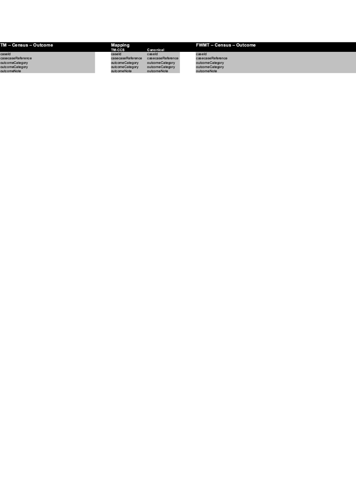

  

# census-fwmt-feedback-service
This service is a gateway between Total Mobile's COMET interface and FWMT feedback service.

It receives a JSON response from TM, transforms it into a FWMT Canonical and places the message onto the Gateway.Feedback RabbitMQ Queue

## Quick Start

Requires RabbitMQ to start:

	docker run --name rabbit -p 5671-5672:5671:5672 -p 15671-15672:15671-15672 -d rabbitmq:3.6-management

To run:

    ./gradlew bootRun

## tm-outcome

## Copyright
Copyright (C) 2018 Crown Copyright (Office for National Statistics)